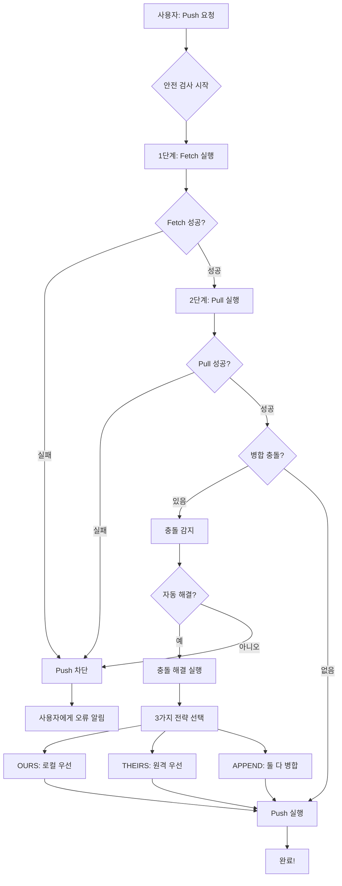
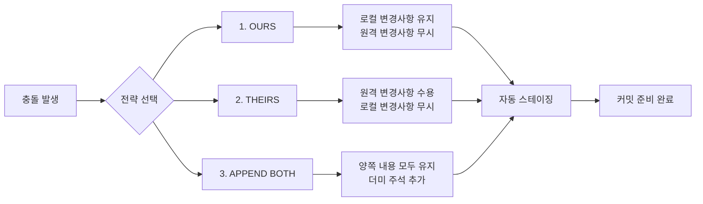
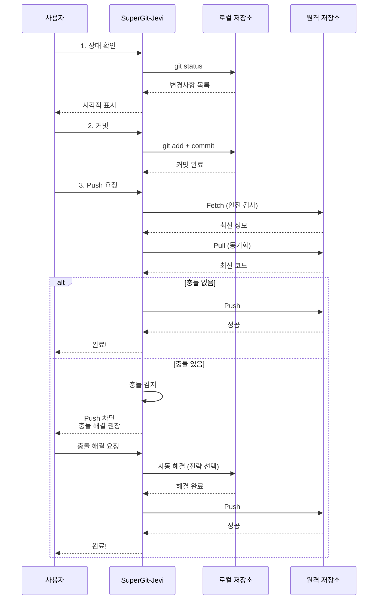

# SuperGit-Jevi

**슈퍼하게 Git을 사용하는 제비처럼 빠른 Java TUI 도구**

## 왜 SuperGit-Jevi인가?

- **슈퍼깃**: Git을 슈퍼롭게 쓸 수 있어서 슈퍼깃
- **제비(Jevi)**: 제비처럼 빠르고 민첩하게! (원래는 자바(Java)였지만 제비가 더 좋아서 제비로 변신)
- **TUI**: 단순 CLI가 아닌 Terminal User Interface로 더 예쁘고 직관적인 경험!

## 핵심 특징

### 안전 기능
- **자동 Fetch+Pull**: Push 전에 반드시 원격 변경사항을 먼저 받아옴
- **충돌 방지 시스템**: Pull 없이 Push하는 인재(人災)를 시스템 레벨에서 차단
- **자동 충돌 해결**: 병합 충돌 발생 시 3가지 전략으로 자동 해결
- **커밋 되돌리기**: 실수한 커밋을 안전하게 되돌리기

### 주요 기능
- 상태 확인 (Status)
- 변경사항 커밋 (Commit)
- 안전한 Push (자동 충돌 방지)
- 브랜치 관리 (생성/전환/삭제)
- 커밋 히스토리 조회
- 원격에서 Pull
- **커밋 되돌리기 (Reset - SOFT/HARD)**
- **자동 충돌 해결 (3가지 전략)**
- **저장소 초기화 (Init)**
- **원격 저장소 복제 (Clone)**

### 혁신적인 고급 기능

#### 1. 커밋 탐색기 (Commit Explorer)
- 커밋을 선택하면 상세 정보 표시
- 변경된 파일 목록 보기
- 전체 Diff 보기
- 특정 파일의 과거 내용 보기
- **시간 여행**: 과거 커밋으로 작업 디렉토리 이동!
- **Cherry-pick**: 특정 커밋의 변경사항만 현재 브랜치에 적용

#### 2. 스마트 검색 (Smart Search)
- **커밋 메시지 검색**: 키워드로 커밋 찾기
- **작성자 검색**: 특정 개발자의 커밋만 보기
- **코드 검색**: 파일 내용에서 텍스트 검색 (줄 번호 표시)
- **파일 이름 검색**: 파일 경로로 빠르게 찾기
- **날짜 범위 검색**: 특정 기간의 커밋만 조회

#### 3. 스마트 비교 (Smart Diff)
- 작업 디렉토리 vs 마지막 커밋
- 두 커밋 간 비교
- 브랜치 간 비교
- 특정 파일만 비교
- **통계 정보**: 추가/수정/삭제 파일 개수

#### 4. 스마트 임시 저장 (Smart Stash)
- 현재 작업 임시 저장
- 임시 저장 목록 관리
- **Stash Pop**: 복원 후 삭제
- **Stash Apply**: 복원하되 보존
- 메시지 기반 stash 관리

### 초보자 친화적
- 숫자 선택 메뉴 방식
- 각 단계마다 설명과 확인
- Ctrl+C로 언제든 종료 가능
- 도움말 내장

## 안전 시스템 작동 원리



## 충돌 해결 전략



## 워크플로우



## 시스템 요구사항

- Java 17 이상
- Git 설치 (권장)
- 지원 OS: **Windows, Linux, macOS** (플랫폼 독립적!)

## 빠른 설치

### Windows 사용자

1. [Java 17 다운로드](https://adoptium.net/)
2. SuperGit-Jevi 릴리스 다운로드
3. 압축 해제 후 `jevi.bat` 더블클릭 또는 cmd에서 실행:
   ```cmd
   jevi.bat
   ```

### Linux/macOS 사용자

```bash
# 저장소 클론 & 빌드
git clone https://github.com/yourusername/supergit-jevi.git
cd supergit-jevi
mvn clean package

# 실행
./jevi.sh
# 또는
java -jar target/supergit-jevi.jar
```

**상세 설치 가이드**: [INSTALL.md](INSTALL.md) 참고

## 설치

```bash
# Maven으로 빌드
mvn clean package

# 실행 (별칭 설정 권장)
alias jevi='java -jar ~/path/to/supergit-jevi.jar'
```

## 사용법

### 대화형 모드 (기본)

```bash
jevi
```

메뉴가 나타나면 숫자를 입력하여 작업을 선택합니다:

```
주 메뉴 - 원하는 작업을 선택하세요:
---------------------------------------------------------------
  [1] 상태 확인 (Status)
  [2] 변경사항 커밋 (Commit)
  [3] 원격 저장소로 Push (안전 모드)
  [4] 브랜치 관리 (Branch)
  [5] 커밋 히스토리 (History)
  [6] 원격에서 Pull

  === 고급 기능 ===
  [7] 커밋 되돌리기 (Reset)
  [8] 충돌 해결 (Conflict Resolver)
  [9] 저장소 초기화/복제 (Init/Clone)
  [10] 커밋 탐색기 (Explore)
  [11] 스마트 검색 (Search)
  [12] 스마트 비교 (Diff)
  [13] 임시 저장 (Stash)

  [h] 도움말 (Help)
  [0] 종료 (Exit)
---------------------------------------------------------------
선택 >
```

## 기능 상세

### 1. 상태 확인 (Status)
- 현재 브랜치 표시
- 수정/추가/삭제/추적 안 됨 파일 분류
- 충돌 파일 강조 표시

### 2. 커밋 (Commit)
- 모든 변경사항 포함 옵션
- 커밋 메시지 입력
- 변경사항 미리보기

### 3. 안전한 Push
**핵심 기능!**
1. 자동 Fetch 실행
2. 자동 Pull 실행
3. 충돌 감지
4. 모든 검사 통과 시에만 Push 허용

### 4. 브랜치 관리
- 브랜치 목록 보기
- 새 브랜치 생성
- 브랜치 전환
- 브랜치 삭제 (확인 프롬프트)

### 5. 커밋 히스토리
- 최근 N개 커밋 표시
- 해시, 메시지, 작성자, 날짜 정보

### 6. Pull
- 원격 저장소의 최신 변경사항 가져오기
- 병합 상태 표시

### 7. 커밋 되돌리기 (Reset)
- **SOFT 모드**: 커밋만 취소, 변경사항 유지
- **HARD 모드**: 모든 변경사항 완전 삭제 (경고 필요)
- 1-10개 커밋 되돌리기 가능

### 8. 자동 충돌 해결
**3가지 전략:**
1. **OURS**: 로컬 변경사항 우선
2. **THEIRS**: 원격 변경사항 우선
3. **APPEND BOTH**: 둘 다 병합 + 더미 주석 추가

### 9. 저장소 초기화/복제
- **Init**: 새로운 Git 저장소 생성
- **Clone**: 원격 저장소 복제 (진행률 표시)

### 10. 커밋 탐색기 (혁신적!)
**UX 하이라이트:**
- 커밋 선택 -> 상세 정보 -> 작업 선택의 직관적 흐름
- 변경된 파일 목록과 상태 시각화
- 전체 Diff 또는 특정 파일 Diff 선택 가능
- **시간 여행**: 과거 커밋 시점으로 이동 (git checkout <commit>)
- **Cherry-pick**: 특정 커밋만 현재에 적용

### 11. 스마트 검색 (강력!)
5가지 검색 모드:
1. **커밋 메시지**: "버그 수정" 같은 키워드로 검색
2. **작성자**: 팀원 이름으로 커밋 찾기
3. **코드 검색**: 파일 내용에서 특정 코드/텍스트 찾기 (줄 번호 포함)
4. **파일 이름**: 경로로 파일 빠르게 찾기
5. **날짜 범위**: 2024-01-01 ~ 2024-12-31 형식으로 기간 검색

### 12. 스마트 비교
- 작업 디렉토리 vs HEAD
- 두 커밋 간 비교 (해시 입력)
- 브랜치 간 비교
- 특정 파일만 비교
- 통계 정보 (추가/수정/삭제 개수)

### 13. 스마트 임시 저장 (Stash)
- **Save**: 현재 작업 임시 보관 (메시지 추가 가능)
- **List**: 모든 stash 목록 보기
- **Pop**: 복원 후 stash 삭제
- **Apply**: 복원하되 stash 유지
- **Drop**: 특정 stash 삭제

## 기술 스택

- **Java 17**: 모던 자바
- **JGit 6.7**: Git 작업을 위한 라이브러리
- **Picocli 4.7**: CLI 프레임워크
- **JANSI 2.4**: 터미널 컬러 출력
- **Maven**: 빌드 도구

## 철학

> "Pull 없이 Push하는 사람은 인재가 아니라 인재(人災)다"

SuperGit-Jevi는 이런 인재를 **시스템 레벨에서 방지**합니다!

## 시스템 요구사항

- Java 17 이상
- Git 설치 (JGit 내장이지만 권장)
- Linux/macOS/Windows 지원

## 예시 시나리오

### 시나리오 1: 안전한 협업
```
1. [1] 상태 확인 - 변경된 파일 5개 확인
2. [2] 커밋 - "기능 추가" 메시지로 커밋
3. [3] Push - 자동으로 fetch+pull 후 안전하게 push
4. 완료! 충돌 없이 팀원과 안전하게 협업
```

### 시나리오 2: 충돌 발생 시
```
1. [3] Push 시도
2. 시스템이 자동으로 fetch+pull
3. 충돌 감지! Push 차단됨
4. [8] 충돌 해결 - APPEND BOTH 선택
5. 자동으로 충돌 해결 완료
6. [2] 커밋으로 병합 저장
7. [3] Push - 이제 성공!
```

### 시나리오 3: 실수 복구
```
1. [5] 히스토리 - 실수한 커밋 확인
2. [7] 커밋 되돌리기 - 2개 커밋 SOFT 모드로 되돌리기
3. 변경사항은 유지되고 커밋만 취소됨
4. 수정 후 다시 커밋
```

### 시나리오 4: 과거 탐험 (시간 여행!)
```
1. [10] 커밋 탐색기 - 관심 있는 커밋 선택
2. 파일 목록 보기 - 어떤 파일이 변경되었는지 확인
3. 특정 파일 내용 보기 - 과거 코드 확인
4. [시간 여행] - 그 시점으로 작업 디렉토리 이동!
5. 코드 탐색 후 원래 브랜치로 복귀
```

### 시나리오 5: 코드 검색의 달인
```
1. [11] 스마트 검색 - 코드 검색 선택
2. "TODO" 입력 - 모든 파일에서 TODO 주석 찾기
3. 파일별로 줄 번호와 함께 결과 표시
4. 빠르게 수정 필요한 곳 파악!
```

### 시나리오 6: 작업 중단하고 급한 일 처리
```
1. [13] 스마트 임시 저장 - Stash Save
2. "긴급 버그 수정" 메시지와 함께 저장
3. [4] 브랜치 전환 - hotfix 브랜치로
4. 버그 수정 완료
5. 원래 브랜치로 복귀
6. [13] Stash Pop - 작업 복원하고 계속
```

## 릴리스 빌드 방법

프로젝트 배포를 위한 릴리스 빌드:

### Linux/macOS:
```bash
./build-release.sh
```

### Windows:
```cmd
build-release.bat
```

생성되는 파일:
- `supergit-jevi-{version}-unix.tar.gz` (Linux/macOS용)
- `supergit-jevi-{version}-windows.zip` (Windows용)

## 라이센스

MIT License - 자유롭게 사용하세요!

## 기여

이슈와 PR은 언제나 환영입니다!

---

**제비처럼 빠르게, 하지만 안전하게 날아올라라!**
