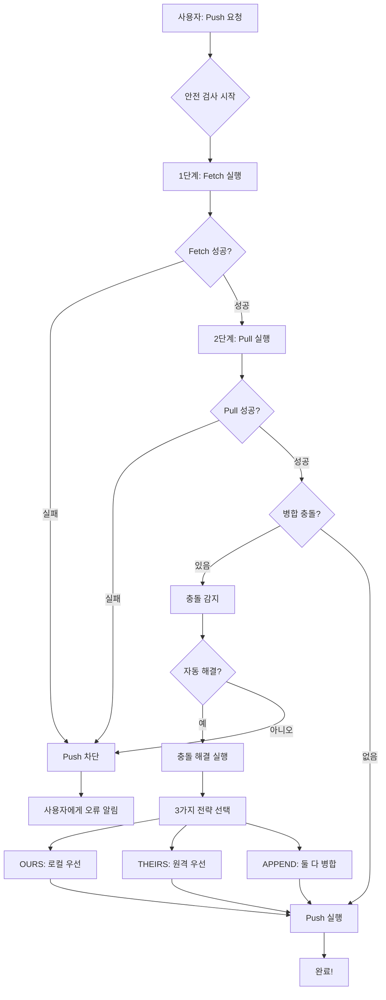
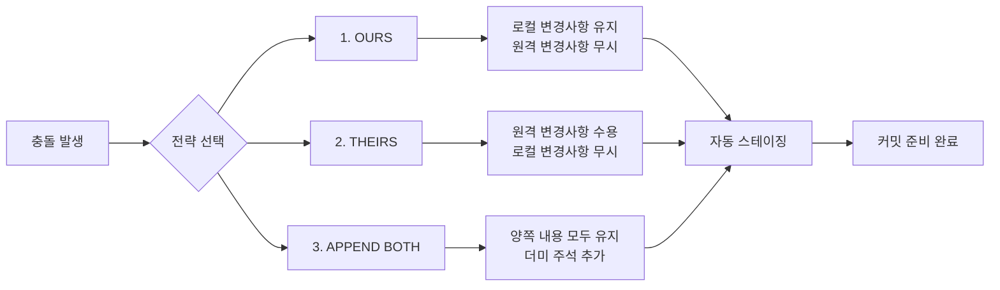
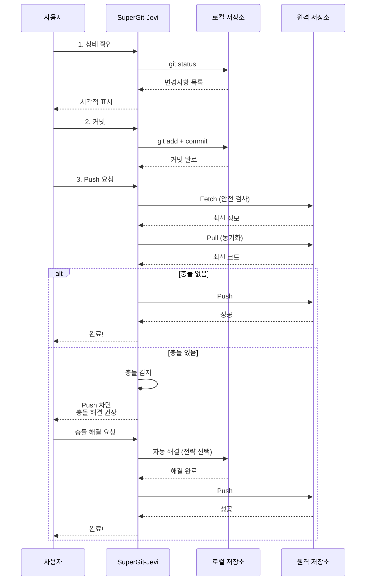

# SuperGit-Jevi

**슈퍼하게 Git을 사용하는 제비처럼 빠른 Java TUI 도구**

## 왜 SuperGit-Jevi인가?

- **슈퍼깃**: Git을 슈퍼롭게 쓸 수 있어서 슈퍼깃
- **제비(Jevi)**: 제비처럼 빠르고 민첩하게! (원래는 자바(Java)였지만 제비가 더 좋아서 제비로 변신)
- **TUI**: 단순 CLI가 아닌 Terminal User Interface로 더 예쁘고 직관적인 경험!

## 핵심 특징

### 안전 기능
- **자동 Fetch+Pull**: Push 전에 반드시 원격 변경사항을 먼저 받아옴
- **충돌 방지 시스템**: Pull 없이 Push하는 인재(人災)를 시스템 레벨에서 차단
- **자동 충돌 해결**: 병합 충돌 발생 시 3가지 전략으로 자동 해결
- **커밋 되돌리기**: 실수한 커밋을 안전하게 되돌리기

### 주요 기능
- 상태 확인 (Status)
- 변경사항 커밋 (Commit)
- 안전한 Push (자동 충돌 방지)
- 브랜치 관리 (생성/전환/삭제)
- 커밋 히스토리 조회
- 원격에서 Pull
- **커밋 되돌리기 (Reset - SOFT/HARD)**
- **자동 충돌 해결 (3가지 전략)**
- **저장소 초기화 (Init)**
- **원격 저장소 복제 (Clone)**

### 초보자 친화적
- 숫자 선택 메뉴 방식
- 각 단계마다 설명과 확인
- Ctrl+C로 언제든 종료 가능
- 도움말 내장

## 안전 시스템 작동 원리



## 충돌 해결 전략



## 워크플로우



## 설치

```bash
# Maven으로 빌드
mvn clean package

# 실행 (별칭 설정 권장)
alias jevi='java -jar ~/path/to/supergit-jevi.jar'
```

## 사용법

### 대화형 모드 (기본)

```bash
jevi
```

메뉴가 나타나면 숫자를 입력하여 작업을 선택합니다:

```
주 메뉴 - 원하는 작업을 선택하세요:
---------------------------------------------------------------
  [1] 상태 확인 (Status)
  [2] 변경사항 커밋 (Commit)
  [3] 원격 저장소로 Push (안전 모드)
  [4] 브랜치 관리 (Branch)
  [5] 커밋 히스토리 (History)
  [6] 원격에서 Pull
  [7] 커밋 되돌리기 (Reset)
  [8] 충돌 해결 (Conflict Resolver)
  [9] 저장소 초기화/복제 (Init/Clone)
  [h] 도움말 (Help)
  [0] 종료 (Exit)
---------------------------------------------------------------
선택 >
```

## 기능 상세

### 1. 상태 확인 (Status)
- 현재 브랜치 표시
- 수정/추가/삭제/추적 안 됨 파일 분류
- 충돌 파일 강조 표시

### 2. 커밋 (Commit)
- 모든 변경사항 포함 옵션
- 커밋 메시지 입력
- 변경사항 미리보기

### 3. 안전한 Push
**핵심 기능!**
1. 자동 Fetch 실행
2. 자동 Pull 실행
3. 충돌 감지
4. 모든 검사 통과 시에만 Push 허용

### 4. 브랜치 관리
- 브랜치 목록 보기
- 새 브랜치 생성
- 브랜치 전환
- 브랜치 삭제 (확인 프롬프트)

### 5. 커밋 히스토리
- 최근 N개 커밋 표시
- 해시, 메시지, 작성자, 날짜 정보

### 6. Pull
- 원격 저장소의 최신 변경사항 가져오기
- 병합 상태 표시

### 7. 커밋 되돌리기 (Reset)
- **SOFT 모드**: 커밋만 취소, 변경사항 유지
- **HARD 모드**: 모든 변경사항 완전 삭제 (경고 필요)
- 1-10개 커밋 되돌리기 가능

### 8. 자동 충돌 해결
**3가지 전략:**
1. **OURS**: 로컬 변경사항 우선
2. **THEIRS**: 원격 변경사항 우선
3. **APPEND BOTH**: 둘 다 병합 + 더미 주석 추가

### 9. 저장소 초기화/복제
- **Init**: 새로운 Git 저장소 생성
- **Clone**: 원격 저장소 복제 (진행률 표시)

## 기술 스택

- **Java 17**: 모던 자바
- **JGit 6.7**: Git 작업을 위한 라이브러리
- **Picocli 4.7**: CLI 프레임워크
- **JANSI 2.4**: 터미널 컬러 출력
- **Maven**: 빌드 도구

## 철학

> "Pull 없이 Push하는 사람은 인재가 아니라 인재(人災)다"

SuperGit-Jevi는 이런 인재를 **시스템 레벨에서 방지**합니다!

## 시스템 요구사항

- Java 17 이상
- Git 설치 (JGit 내장이지만 권장)
- Linux/macOS/Windows 지원

## 예시 시나리오

### 시나리오 1: 안전한 협업
```
1. [1] 상태 확인 - 변경된 파일 5개 확인
2. [2] 커밋 - "기능 추가" 메시지로 커밋
3. [3] Push - 자동으로 fetch+pull 후 안전하게 push
4. 완료! 충돌 없이 팀원과 안전하게 협업
```

### 시나리오 2: 충돌 발생 시
```
1. [3] Push 시도
2. 시스템이 자동으로 fetch+pull
3. 충돌 감지! Push 차단됨
4. [8] 충돌 해결 - APPEND BOTH 선택
5. 자동으로 충돌 해결 완료
6. [2] 커밋으로 병합 저장
7. [3] Push - 이제 성공!
```

### 시나리오 3: 실수 복구
```
1. [5] 히스토리 - 실수한 커밋 확인
2. [7] 커밋 되돌리기 - 2개 커밋 SOFT 모드로 되돌리기
3. 변경사항은 유지되고 커밋만 취소됨
4. 수정 후 다시 커밋
```

## 라이센스

MIT License - 자유롭게 사용하세요!

## 기여

이슈와 PR은 언제나 환영입니다!

---

**제비처럼 빠르게, 하지만 안전하게 날아올라라!**
