# SuperGit-Jevi

**제비처럼 빠르고 안전한 Git 터미널 도구**

SuperGit-Jevi는 Git을 더 쉽고 안전하게 사용할 수 있도록 설계된 Java 기반 TUI(Terminal User Interface) 도구입니다.

## 목차

- [주요 특징](#주요-특징)
- [두 가지 버전](#두-가지-버전)
  - [Java TUI 버전](#java-tui-버전)
  - [웹 버전 (NEW!)](#웹-버전-new)
- [시스템 요구사항](#시스템-요구사항)
- [설치 방법](#설치-방법)
  - [Windows](#windows-설치)
  - [Linux](#linux-설치)
  - [macOS](#macos-설치)
- [사용 방법](#사용-방법)
- [기능 목록](#기능-목록)
- [아키텍처](#아키텍처)
- [워크플로우](#워크플로우)
- [기술 문서](#기술-문서)
- [라이선스](#라이선스)

## 주요 특징

### 안전성

- **자동 충돌 방지**: Push 전 자동으로 Fetch와 Pull 수행
- **시스템 레벨 차단**: Pull 없이 Push하는 것을 원천 차단
- **자동 충돌 해결**: 3가지 전략(OURS, THEIRS, APPEND BOTH)으로 병합 충돌 자동 처리
- **안전한 Reset**: SOFT/HARD 모드 선택 가능, 경고 메시지 제공

### 사용성

- **대화형 메뉴**: 숫자 선택 방식의 직관적인 인터페이스
- **초보자 친화적**: 각 단계마다 상세한 설명 제공
- **컬러 터미널**: 상태별로 색상 구분하여 가독성 향상
- **플랫폼 독립적**: Windows, Linux, macOS 모두 지원

### 고급 기능

- **커밋 탐색기**: 과거 커밋을 상세히 탐색하고 시간 여행 가능
- **스마트 검색**: 커밋 메시지, 작성자, 코드 내용, 파일명, 날짜로 검색
- **스마트 비교**: 다양한 방식으로 변경사항 비교
- **스마트 임시 저장**: Stash를 쉽게 관리

### AI Agent 기능

- **Snapshot**: 저장소의 모든 히스토리와 현재 상태를 통합하여 AI가 이해 가능한 형식으로 제공
- **JSON/TEXT 형식**: AI 최적화 JSON 또는 사람이 읽기 쉬운 TEXT 형식 지원
- **파일 진화 추적**: 각 파일의 생성부터 현재까지 전체 변경 이력 추적
- **가상 파일 시스템**: 삭제된 파일 포함 완전한 파일 시스템 뷰 제공

## 두 가지 버전

SuperGit-Jevi는 두 가지 버전으로 제공됩니다:

### Java TUI 버전

**전통적인 터미널 기반 도구**


**특징:**
- 🖥️ 터미널에서 직접 실행
- ⚡ JGit으로 네이티브 성능
- 🔧 SSH/HTTPS 인증 모두 지원
- 📦 단일 JAR 파일로 배포

**사용 사례:**
- CI/CD 파이프라인
- 서버 환경
- 대용량 저장소
- 로컬 개발 환경

**실행:**
```bash
java -jar target/supergit-jevi.jar
# 또는
./jevi.sh
```

### 웹 버전 (NEW!)

**브라우저에서 실행되는 혁신적인 버전**

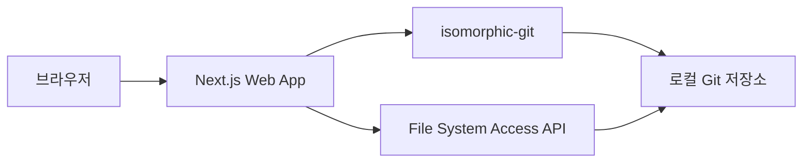

**특징:**
- 🌐 완전한 클라이언트 사이드 (서버 불필요!)
- 📁 File System Access API로 로컬 폴더 직접 접근
- 🖥️ xterm.js 기반 완벽한 터미널 UI
- 🔒 모든 데이터는 로컬에만 저장
- 🚀 정적 호스팅 가능 (Vercel, Netlify, GitHub Pages)

**사용 사례:**
- 원격 작업 환경
- 설치 없이 바로 사용
- 교육 및 데모
- 가벼운 Git 작업

**실행:**
```bash
cd webapp
npm install
npm run dev
# http://localhost:3000
```

**브라우저 요구사항:**
- Chrome/Edge 86+
- Safari 15.2+

**온라인 데모:** [Coming Soon]

### 버전 비교

| 기능 | Java TUI | 웹 버전 |
|------|----------|---------|
| **실행 환경** | 터미널 | 브라우저 |
| **설치** | Java 17+ 필요 | 브라우저만 필요 |
| **Git 엔진** | JGit | isomorphic-git |
| **인증** | SSH/HTTPS | HTTPS (Token) |
| **대용량 저장소** | ✅ 제한 없음 | ⚠️ 브라우저 제한 |
| **네트워크** | ✅ 직접 연결 | ⚠️ CORS Proxy |
| **오프라인** | ✅ 완전 지원 | ⚠️ 제한적 |
| **성능** | ⚡ 매우 빠름 | ✅ 빠름 |
| **플랫폼** | 모든 OS | 지원 브라우저만 |
| **배포** | JAR 파일 | 정적 웹사이트 |
| **UI/UX** | 터미널 TUI | 웹 터미널 |

**선택 가이드:**
- **Java TUI 선택**: CI/CD, 서버 환경, 대용량 저장소, SSH 필요
- **웹 버전 선택**: 설치 없이 사용, 원격 작업, 교육/데모, 가벼운 작업

## 시스템 요구사항

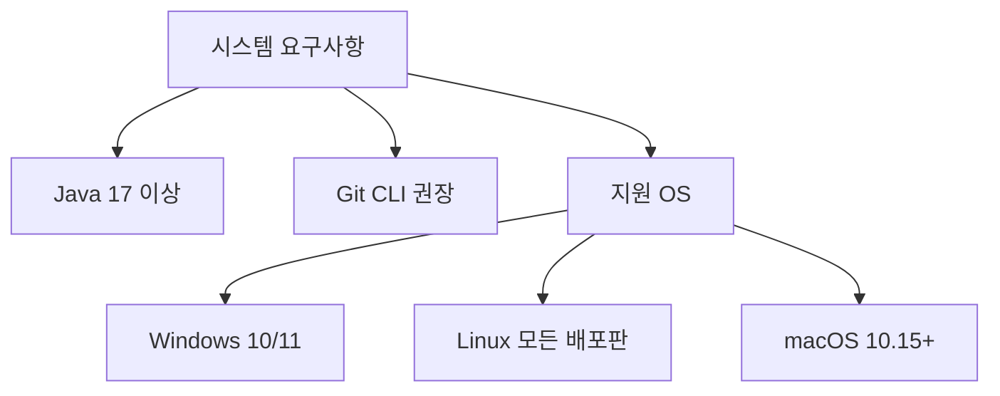

- **필수**: Java 17 이상
- **권장**: Git CLI 설치
- **지원 OS**: Windows, Linux, macOS

## 설치 방법

### 설치 프로세스 다이어그램

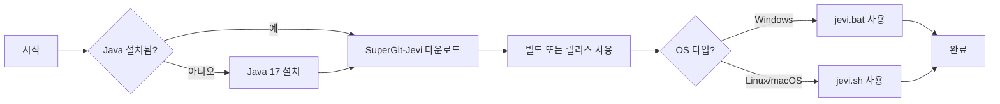

### Java 설치 확인

모든 플랫폼에서 먼저 Java 버전을 확인하세요:

```bash
java -version
```

Java 17 이상이 표시되어야 합니다.

---

### Windows 설치

#### 1단계: Java 설치

**방법 A - Oracle JDK:**
1. https://www.oracle.com/java/technologies/downloads/ 방문
2. Windows 용 Java 17 또는 최신 버전 다운로드
3. 설치 파일 실행
4. 설치 완료 후 cmd에서 `java -version` 확인

**방법 B - OpenJDK (Adoptium):**
1. https://adoptium.net/ 방문
2. Windows x64 용 JDK 17 다운로드
3. MSI 파일 실행하여 설치
4. 환경변수 자동 설정됨

#### 2단계: SuperGit-Jevi 설치

**방법 1 - 릴리스 다운로드 (권장):**

```cmd
# 1. 릴리스 다운로드
# https://github.com/yourusername/supergit-jevi/releases

# 2. ZIP 압축 해제
# supergit-jevi-1.0.0-windows.zip

# 3. 폴더 이동
cd C:\supergit-jevi

# 4. 실행
jevi.bat
```

**방법 2 - 소스에서 빌드:**

```cmd
# 1. Git 저장소 클론
git clone https://github.com/yourusername/supergit-jevi.git
cd supergit-jevi

# 2. Maven 빌드
mvn clean package

# 3. 실행
jevi.bat
```

#### 3단계: PATH 설정 (선택사항)

어디서나 `jevi` 명령을 사용하려면:

1. `시스템 속성` 열기 (Win + Pause)
2. `고급 시스템 설정` 클릭
3. `환경 변수` 클릭
4. `시스템 변수`에서 `Path` 선택 후 `편집`
5. `새로 만들기` 클릭
6. SuperGit-Jevi 설치 경로 입력 (예: `C:\supergit-jevi`)
7. 확인 후 cmd 재시작
8. 이제 아무 곳에서나 `jevi` 실행 가능

---

### Linux 설치

#### 1단계: Java 설치

**Ubuntu/Debian:**
```bash
sudo apt update
sudo apt install openjdk-17-jdk
java -version
```

**Fedora/RHEL/CentOS:**
```bash
sudo dnf install java-17-openjdk java-17-openjdk-devel
java -version
```

**Arch Linux:**
```bash
sudo pacman -S jdk17-openjdk
java -version
```

#### 2단계: SuperGit-Jevi 설치

**방법 1 - 릴리스 다운로드:**

```bash
# 1. 릴리스 다운로드 및 압축 해제
wget https://github.com/yourusername/supergit-jevi/releases/download/v1.0.0/supergit-jevi-1.0.0-unix.tar.gz
tar -xzf supergit-jevi-1.0.0-unix.tar.gz
cd supergit-jevi-1.0.0

# 2. 실행
./jevi.sh
```

**방법 2 - 소스에서 빌드:**

```bash
# 1. 저장소 클론
git clone https://github.com/yourusername/supergit-jevi.git
cd supergit-jevi

# 2. 빌드
mvn clean package

# 3. 실행
./jevi.sh
```

#### 3단계: 시스템 전역 설치 (선택사항)

```bash
# 심볼릭 링크 생성
sudo ln -s $(pwd)/jevi.sh /usr/local/bin/jevi

# 이제 아무 디렉토리에서나 실행 가능
jevi
```

**또는 별칭 사용:**

```bash
# ~/.bashrc 또는 ~/.zshrc에 추가
echo 'alias jevi="java -jar /path/to/supergit-jevi/target/supergit-jevi.jar"' >> ~/.bashrc
source ~/.bashrc
```

---

### macOS 설치

#### 1단계: Java 설치

**Homebrew 사용 (권장):**
```bash
# Homebrew 설치 (없는 경우)
/bin/bash -c "$(curl -fsSL https://raw.githubusercontent.com/Homebrew/install/HEAD/install.sh)"

# Java 17 설치
brew install openjdk@17

# PATH 설정
echo 'export PATH="/opt/homebrew/opt/openjdk@17/bin:$PATH"' >> ~/.zshrc
source ~/.zshrc

# 확인
java -version
```

**수동 설치:**
1. https://adoptium.net/ 방문
2. macOS 용 JDK 17 다운로드
3. PKG 파일 실행하여 설치

#### 2단계: SuperGit-Jevi 설치

```bash
# 1. 저장소 클론
git clone https://github.com/yourusername/supergit-jevi.git
cd supergit-jevi

# 2. 빌드
mvn clean package

# 3. 실행
./jevi.sh
```

#### 3단계: 전역 설치 (선택사항)

```bash
# 심볼릭 링크 생성
sudo ln -s $(pwd)/jevi.sh /usr/local/bin/jevi

# 또는 별칭 사용 (zsh의 경우)
echo 'alias jevi="java -jar /path/to/supergit-jevi/target/supergit-jevi.jar"' >> ~/.zshrc
source ~/.zshrc
```

---

## 사용 방법

### 기본 실행

Git 저장소가 있는 디렉토리에서:

```bash
# Windows
jevi.bat

# Linux/macOS
./jevi.sh
# 또는 (전역 설치한 경우)
jevi
```

### 메뉴 구조

```
SuperGit-Jevi 메인 메뉴
├── [1] 상태 확인 (Status) (for human)
├── [2] 변경사항 커밋 (Commit) (for human)
├── [3] 원격 저장소로 Push (안전 모드) (for human)
├── [4] 브랜치 관리 (Branch) (for human)
├── [5] 커밋 히스토리 (History) (for human)
├── [6] 원격에서 Pull (for human)
├── === 고급 기능 ===
├── [7] 커밋 되돌리기 (Reset) (for human)
├── [8] 충돌 해결 (Conflict Resolver) (for human)
├── [9] 저장소 초기화/복제 (Init/Clone) (for human)
├── [10] 커밋 탐색기 (Explore) (for human)
├── [11] 스마트 검색 (Search) (for human)
├── [12] 스마트 비교 (Diff) (for human)
├── [13] 임시 저장 (Stash) (for human)
├── === AI Agent 기능 ===
├── [14] 스냅샷 (Snapshot) (for AI)
├── [h] 도움말 (for human, AI)
└── [0] 종료
```

## 기능 목록

### 기본 기능

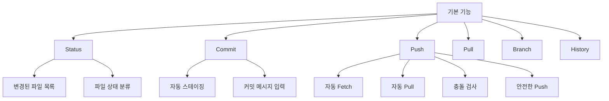

**1. Status (상태 확인)**
- 현재 브랜치 표시
- 수정/추가/삭제/추적안됨 파일 분류
- 충돌 파일 강조

**2. Commit (커밋)**
- 변경사항 자동 스테이징 옵션
- 커밋 메시지 입력
- 커밋 정보 표시

**3. Push (안전한 푸시)**
- 단계 1: 자동 Fetch
- 단계 2: 자동 Pull
- 단계 3: 충돌 검사
- 단계 4: Push 실행 (안전한 경우만)

**4. Pull (풀)**
- 원격 저장소 최신 변경사항 가져오기
- 병합 상태 표시

**5. Branch (브랜치 관리)**
- 브랜치 목록 보기
- 새 브랜치 생성
- 브랜치 전환
- 브랜치 삭제

**6. History (히스토리)**
- 커밋 목록 표시
- 해시, 메시지, 작성자, 날짜 정보

### 고급 기능

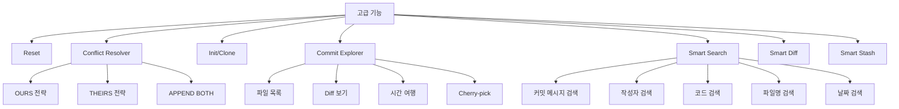

**7. Reset (커밋 되돌리기)**
- SOFT 모드: 커밋만 취소, 변경사항 유지
- HARD 모드: 모든 것 삭제 (경고 포함)
- 1-10개 커밋 되돌리기

**8. Conflict Resolver (충돌 해결)**
- OURS: 로컬 변경사항 우선
- THEIRS: 원격 변경사항 우선
- APPEND BOTH: 양쪽 모두 병합

**9. Init/Clone (저장소 초기화/복제)**
- 새 저장소 초기화
- 원격 저장소 복제

**10. Commit Explorer (커밋 탐색기)**
- 커밋 상세 정보 표시
- 변경된 파일 목록
- 전체 Diff 보기
- 특정 파일 내용 보기
- 시간 여행 (과거 커밋으로 체크아웃)
- Cherry-pick

**11. Smart Search (스마트 검색)**
- 커밋 메시지에서 키워드 검색
- 작성자로 필터링
- 파일 내용에서 코드 검색 (줄 번호 표시)
- 파일명으로 검색
- 날짜 범위로 검색

**12. Smart Diff (스마트 비교)**
- 작업 디렉토리 vs HEAD
- 두 커밋 간 비교
- 브랜치 간 비교
- 특정 파일만 비교
- 통계 정보

**13. Smart Stash (스마트 임시 저장)**
- 현재 작업 임시 저장
- Stash 목록 보기
- Stash Pop (복원 후 삭제)
- Stash Apply (복원하되 유지)
- Stash Drop (삭제)

### AI Agent 전용 기능

**14. Snapshot (스냅샷) - AI를 위한 통합 뷰**

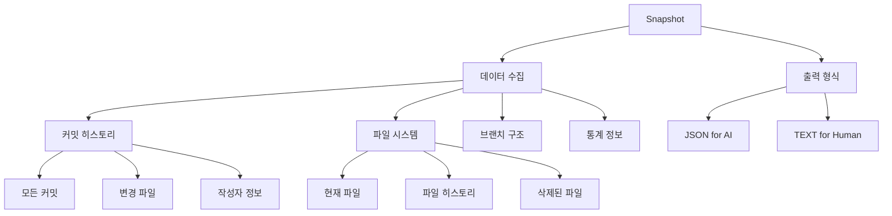

**주요 기능:**
- 저장소의 모든 커밋 히스토리 통합
- 파일별 전체 생명주기 추적 (생성 -> 수정 -> 삭제)
- 삭제된 파일 포함 가상 파일 시스템
- 브랜치 구조 및 머지 히스토리
- JSON (AI 최적화) 또는 TEXT (Human 친화) 형식
- 특정 파일의 전체 변경 이력 추적

**사용 예시:**
```bash
# AI Agent가 전체 컨텍스트를 JSON으로 받기
jevi
14  # Snapshot 선택
1   # JSON 형식
y   # 파일로 저장
context.json

# 특정 파일의 전체 히스토리 추적
jevi
14  # Snapshot
4   # 특정 파일 추적
src/Main.java
```

**AI Agent 활용 시나리오:**
- 코드베이스 전체 이해
- 버그 추적 및 분석
- 자동 문서화
- 리팩토링 지원
- Release Notes 생성

## 아키텍처

### 시스템 구조

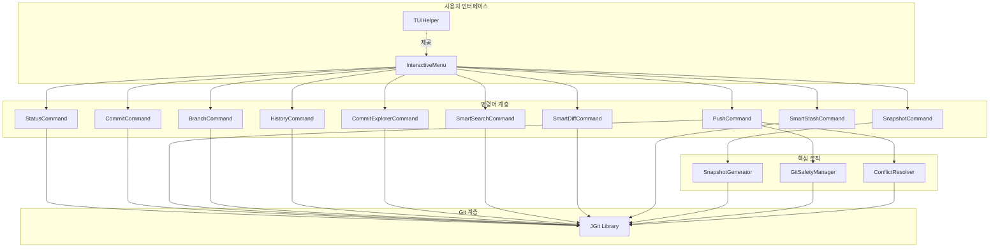

### 안전 시스템 작동 원리

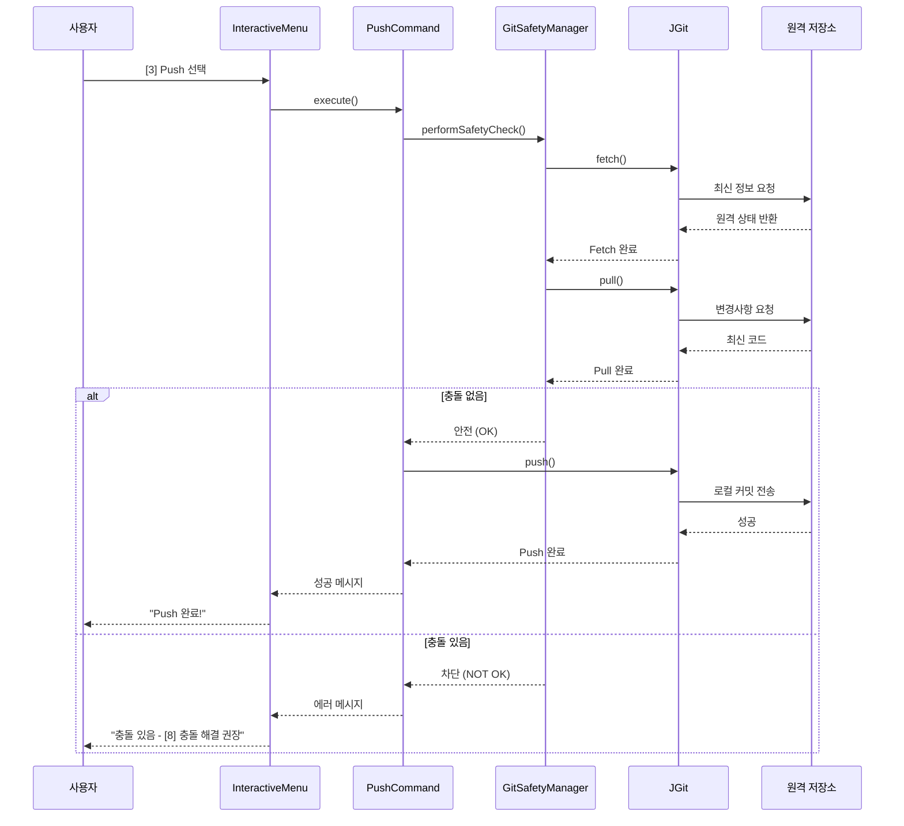

### 충돌 해결 프로세스

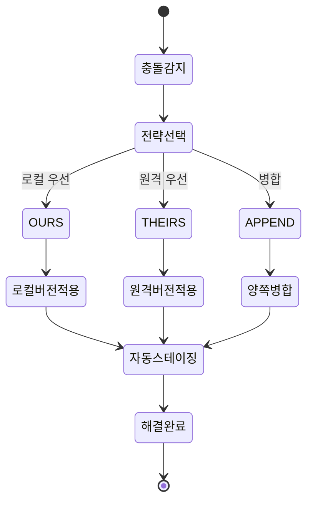

## 워크플로우

### 기본 워크플로우

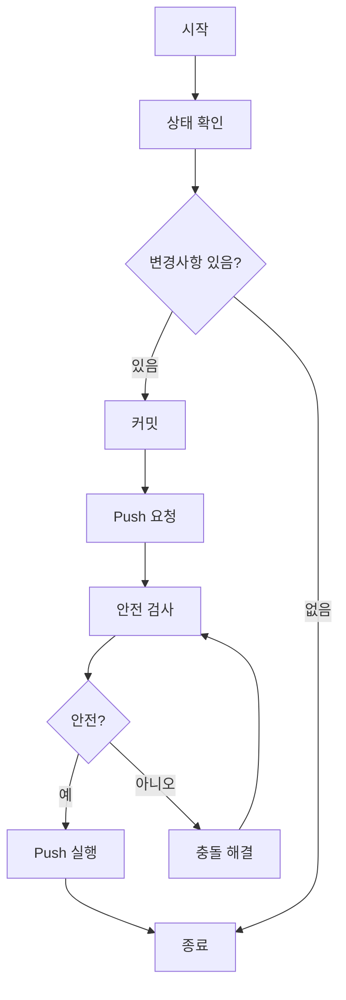

### 충돌 발생 시 워크플로우

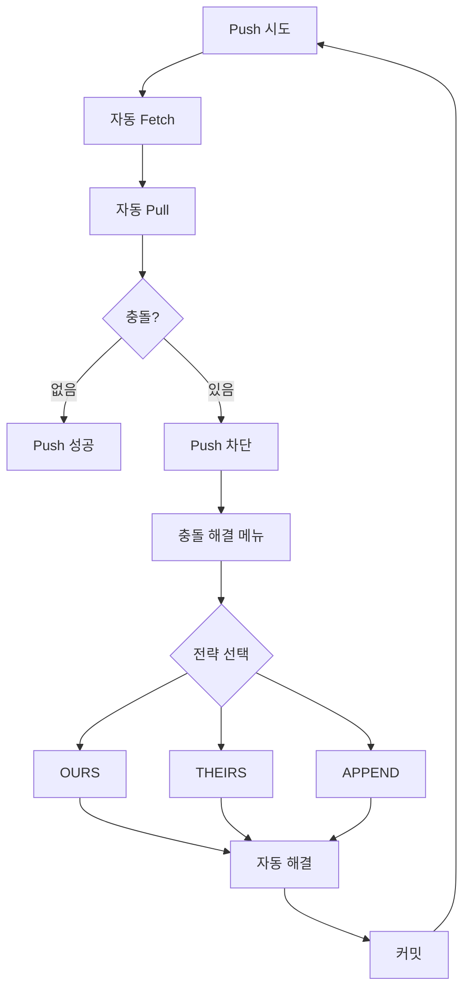

### 시간 여행 워크플로우

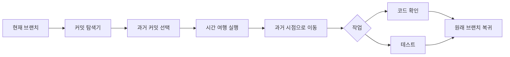

## 예제 시나리오

### 시나리오 1: 일반적인 작업 흐름

```
1. 코드 수정
2. jevi 실행
3. [1] 상태 확인 - 5개 파일 변경됨
4. [2] 커밋 - "기능 추가" 메시지
5. [3] Push - 자동으로 fetch+pull 후 안전하게 push
6. 완료!
```

### 시나리오 2: 충돌 발생 및 해결

```
1. [3] Push 시도
2. 시스템이 자동으로 fetch+pull
3. 충돌 감지! Push 차단됨
4. [8] 충돌 해결 선택
5. APPEND BOTH 전략 선택
6. 자동으로 충돌 해결 완료
7. [2] 커밋으로 병합 저장
8. [3] Push - 이제 성공!
```

### 시나리오 3: 과거 코드 탐색

```
1. [10] 커밋 탐색기
2. 3개월 전 커밋 선택
3. 변경된 파일 목록 확인
4. 특정 파일의 과거 내용 보기
5. [시간 여행] 실행
6. 과거 코드 상태로 이동하여 분석
7. 원래 브랜치로 복귀
```

### 시나리오 4: AI Agent가 저장소 분석

```
1. [14] 스냅샷 선택
2. JSON 형식 선택 (AI 최적화)
3. 파일로 저장: repo-context.json
4. AI Agent가 JSON 파싱:
   - 150개 커밋 분석
   - 5명의 기여자 식별
   - 파일 간 의존성 파악
   - 버그 패턴 발견
   - 자동 문서 생성
5. AI가 인사이트 제공:
   "Main.java는 지난 3개월간 15번 수정되었으며,
    주로 버그 수정이 많았습니다. 리팩토링 권장합니다."
```

## 도움말

SuperGit-Jevi 내에서 언제든지 `h` 키를 입력하여 상세한 도움말을 볼 수 있습니다.

### 도움말 메뉴 내용

도움말에서는 다음 정보를 제공합니다:

- **기본 기능**: 각 기능의 상세 설명과 사용 시점
- **고급 기능**: 커밋 탐색기, 스마트 검색, 충돌 해결 등
- **AI 기능**: 스냅샷 기능의 활용법
- **안전 시스템**: Push 전 자동 검사 프로세스
- **워크플로우**: 초보자를 위한 단계별 가이드
- **빌드 명령어**: Maven 빌드 및 실행 방법
- **유용한 팁**: 커밋, 브랜치, 협업 관련 모범 사례
- **문제 해결**: 일반적인 문제 상황과 해결 방법

### 빠른 참조

**자주 사용하는 명령어:**

```
[1] Status     # 변경사항 확인
[2] Commit     # 커밋하기
[3] Push       # 안전하게 Push
[6] Pull       # 최신 변경사항 받기
[h] Help       # 상세 도움말
[0] Exit       # 종료
```

**문제 해결:**

```
Push 차단?         → [8] 충돌 해결
잘못 커밋?         → [7] Reset
과거 코드 확인?    → [10] 커밋 탐색기
변경사항 찾기?     → [11] 스마트 검색
급한 작업 전환?    → [13] Stash
```

**안전 팁:**

- 작업 시작 전 항상 Pull
- 커밋은 자주, 작은 단위로
- Push 전 Status로 확인
- 브랜치로 실험하기
- HARD Reset은 신중하게

## 기술 스택

- **언어**: Java 17
- **빌드 도구**: Maven 3.8+
- **Git 라이브러리**: JGit 6.7
- **CLI 프레임워크**: Picocli 4.7
- **터미널 출력**: JANSI 2.4

## 빌드 및 배포

### 빠른 빌드 가이드

SuperGit-Jevi는 Maven을 사용하여 빌드합니다.

#### 전체 빌드 (권장)

```bash
# 클린 빌드 - 모든 이전 빌드 삭제 후 새로 빌드
mvn clean package

# 빌드 완료 후 실행
java -jar target/supergit-jevi.jar
```

#### 빠른 빌드 (변경사항만)

```bash
# clean 없이 빌드 (더 빠름)
mvn package

# 실행
java -jar target/supergit-jevi.jar
```

#### 테스트 건너뛰기 빌드

```bash
# 테스트 생략하고 빌드 (가장 빠름)
mvn clean package -DskipTests

# 실행
java -jar target/supergit-jevi.jar
```

#### 빌드 + 즉시 실행 (One-liner)

**Linux/macOS:**
```bash
mvn clean package && java -jar target/supergit-jevi.jar
```

**Windows (PowerShell):**
```powershell
mvn clean package; if ($?) { java -jar target/supergit-jevi.jar }
```

**Windows (CMD):**
```cmd
mvn clean package && java -jar target/supergit-jevi.jar
```

### 빌드 스크립트 사용

편의를 위해 제공되는 빌드 스크립트:

**Linux/macOS:**
```bash
# 실행 권한 부여
chmod +x build-release.sh jevi.sh

# 빌드 및 실행
./build-release.sh
./jevi.sh
```

**Windows:**
```cmd
# 빌드 및 실행
build-release.bat
jevi.bat
```

### 빌드 출력물

빌드 성공 시 생성되는 파일:

```
target/
├── supergit-jevi.jar           # Fat JAR (모든 의존성 포함)
├── supergit-jevi-1.0.0.jar     # 원본 JAR (의존성 없음)
└── classes/                    # 컴파일된 클래스 파일
```

**중요**: `supergit-jevi.jar` 파일을 사용하세요 (모든 의존성 포함된 버전)

### 릴리스 빌드 (배포용)

**Linux/macOS:**
```bash
./build-release.sh
```

**Windows:**
```cmd
build-release.bat
```

생성 파일:
- `release/supergit-jevi-{version}-unix.tar.gz` (Linux/macOS용)
- `release/supergit-jevi-{version}-windows.zip` (Windows용)

### Maven 의존성 업데이트

의존성을 최신 버전으로 업데이트:

```bash
# 의존성 버전 확인
mvn versions:display-dependency-updates

# 의존성 업데이트 (신중하게!)
mvn versions:use-latest-releases
```

### 빌드 문제 해결

**문제 1: "mvn: command not found"**
```bash
# Maven 설치 확인
mvn -version

# Ubuntu/Debian
sudo apt install maven

# Fedora/RHEL
sudo dnf install maven

# macOS
brew install maven

# Windows - Chocolatey
choco install maven
```

**문제 2: 빌드 실패 - 의존성 다운로드 오류**
```bash
# Maven 캐시 삭제
rm -rf ~/.m2/repository

# 다시 빌드
mvn clean package
```

**문제 3: Java 버전 불일치**
```bash
# 현재 Java 버전 확인
java -version

# Java 17 이상 필요
# pom.xml에서 확인:
# <maven.compiler.source>17</maven.compiler.source>
```

**문제 4: 메모리 부족**
```bash
# Maven 힙 메모리 증가
export MAVEN_OPTS="-Xmx1024m"
mvn clean package
```

## 트러블슈팅

### "java: command not found"
- Java가 설치되지 않았거나 PATH에 없음
- Java 17 설치 후 터미널 재시작

### "UnsupportedClassVersionError"
- Java 버전이 낮음
- Java 17 이상으로 업그레이드

### "Git 저장소를 찾을 수 없습니다"
- 현재 디렉토리가 Git 저장소가 아님
- `git init` 실행 또는 [9] 메뉴 사용

### Windows에서 실행이 안됨
- PATH에 Java가 없을 수 있음
- 전체 경로로 시도: `java -jar C:\path\to\supergit-jevi.jar`

## 기여하기

이슈 및 Pull Request는 환영합니다!

## 기술 문서

프로젝트의 상세한 기술 문서는 `docs/` 폴더에서 확인할 수 있습니다:

- **[AI-AGENT-SNAPSHOT-SPEC.md](docs/AI-AGENT-SNAPSHOT-SPEC.md)** - AI Agent를 위한 스냅샷 기능 명세
- **[SNAPSHOT-IMPLEMENTATION-REPORT.md](docs/SNAPSHOT-IMPLEMENTATION-REPORT.md)** - 스냅샷 기능 구현 보고서
- **[WEB-VERSION-IMPLEMENTATION.md](docs/WEB-VERSION-IMPLEMENTATION.md)** - 웹 버전 기술 구현 보고서 (NEW!)

## 웹 버전

SuperGit-Jevi는 웹 버전도 제공합니다!

### SuperGit-Jevi Web

브라우저에서 직접 실행되는 웹 버전입니다.

**특징:**
- 🌐 완전한 클라이언트 사이드 (서버 불필요)
- 📁 File System Access API로 로컬 폴더 접근
- 🖥️ xterm.js 기반 터미널 UI
- 🔒 모든 데이터는 로컬에만 저장

**시작하기:**
\`\`\`bash
cd webapp
npm install
npm run dev
# http://localhost:3000 열기
\`\`\`

**브라우저 요구사항:**
- Chrome/Edge 86+
- Safari 15.2+
- (Firefox는 현재 미지원 - File System Access API 없음)

**자세한 내용:** 
- [webapp/README.md](webapp/README.md) - 웹 버전 사용 가이드
- [docs/WEB-VERSION-IMPLEMENTATION.md](docs/WEB-VERSION-IMPLEMENTATION.md) - 기술 구현 보고서

## 라이선스

MIT License - [LICENSE](LICENSE) 파일 참조

Copyright (c) 2026 Rheehose

---

**SuperGit-Jevi - 제비처럼 빠르게, 하지만 안전하게**
